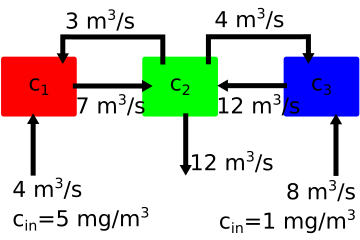
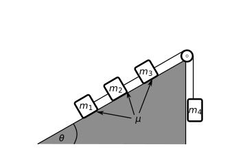

---
jupytext:
  formats: notebooks//ipynb,md:myst
  text_representation:
    extension: .md
    format_name: myst
    format_version: 0.13
    jupytext_version: 1.10.3
kernelspec:
  display_name: Python 3
  language: python
  name: python3
---

# Linear Algebra Introduction

Linear algebra is a representation of linear equations. You can separate the known constants from unknown variables to represent your system of equations. Take the following example, there are three unknowns and three equations

1. $5x_{1}+3x_{2} =1$

2. $x_{1}+2x_{2}+3x_{3} =2$

3. $x_{1}+x_{2}+x_{3} =3$

If you can represent your equations in a matrix-vector format, then you can use standard linear algebra routines to solve for the unknown variables, $x_1,~x_2,~and~x_3.$

Consider the matrix form of equations 1-3 above:

$\left[ \begin{array}{ccc}
5 & 3 & 0 \\
1 & 2 & 3 \\
1 & 1 & 1 \end{array} \right]
\left[\begin{array}{c} 
x_{1} \\ 
x_{2} \\
x_{3}\end{array}\right]=\left[\begin{array}{c} 
1 \\
2 \\
3\end{array}\right]$

$\mathbf{Ax}=\mathbf{b}$

The __matrix__, $\mathbf{A}$ contains all of the constants that are multiplied by your unknown variables $x_1,~x_2,~and~x_3.$ The __vector__, $\mathbf{y}$ contains all of the known constants that are not multiplied by your unknown variables $x_1,~x_2,~and~x_3.$ Finally, the __vector__, $\mathbf{x}=[x_1,~x_2,~x_3]$ contains your unknown values. 

## Exercise

Solve for $x_1,~x_2,~and~x_3.$ How did you approach the problem? Did you use Linear algebra?

Highlight for answers: <font color="white">x1 = 20, x2 = -33, x3 = 16</font>

```{code-cell} ipython3
import numpy as np
```

```{code-cell} ipython3
A=np.array([[-7,3,0],[7,-19,12],[0,4,-12]])
b=np.array([-20,0,-8])

x = np.linalg.solve(A,b)
for i in range(0,3):
    print('[{:5.1f} {:5.1f} {:5.1f}] {} [{:3.1f}] {} [{:5.1f}]'.format(*A[i],'*',x[i],'=',b[i]))
```

You use linear algebra _operations_ to standardize the way you approach a set of equations. If you knew another matrix $\mathbf{A}^{-1}$ that you could multiply both sides of your equation and get a new equation

$\mathbf{A^{-1} A x}= \mathbf{A_n b}$

where $\mathbf{A^{-1} A x} = \mathbf{x}$

then $\mathbf{x} = \mathbf{A^{-1} b}$

if this youre a single equation with a single unknown, then you just use the inverse of A as such

$12 x = 6$

$\frac{1}{12} 12 x = \frac{1}{12} 6$

$x=2$

In this notebook, you will look at how to frame your problems as linear algebra problems and work on how to get $\mathbf{A}^{-1}$ or $\mathbf{x}$ in the next two notebooks. 

## Example with Mixing Tanks



In the diagram above you have three tanks of water that are mixing two concentrations of salt water with $5~mg/m^3$ entering tank 1 and $1~mg/m^3$ entering tank three. The outlet is located on the middle tank 2, but the concentration is unknown. 

The volume flow rates of water are shown on each arrow to denote flow in/out of each tank. You want to know what the final concentration at the outlet is $c_2$, but in order to know that you need the concentrations of $c_1~and~c_3$. The mass flow of the salt is the concentration $\times$ volume flow rate. The total mass flow in - mass flow out in each container is 0. You have three mass balance equations

1. $(-7~m^3/s)~c_1 +(3~m^3/s)~c_2 +(4~m^3/s)~5~mg/m^3 = 0$

2. $(7~m^3/s)~c_1 -(3~m^3/s)~c_2 -(4~m^3/s)~c_2 -(12~m^3/s)~c_2 +(12~m^3/s)~c_3 = 0$

3. $(4~m^3/s)~c_2 -(12~m^3/s)~c_3 + (8~m^3/s)~1~mg/m^3 = 0$

or rearranging your mass-balance equations you have

1. $-7c_1+3c_2=-20$

2. $7c_1-19c_2+12c_3=0$

3. $4c_2-12c_3=-8$

You can put this into the same form that you used above with the matrix $\mathbf{A}$ and vectors $\mathbf{x}$ and $\mathbf{b}$

$\left[ \begin{array}{ccc}
-7 & 3 & 0 \\
7 & -19 & 12 \\
0 & 4 & -12 \end{array} \right]
\left[\begin{array}{c} 
c_{1} \\ 
c_{2} \\
c_{3}\end{array}\right]=\left[\begin{array}{c} 
-20 \\
0 \\
-8\end{array}\right]$

$\mathbf{Ax}=\mathbf{b}$

Now, let's use some numpy linear algebra to solve for $c_2$. First, define $\mathbf{A}$ and $\mathbf{b}$ your known constants.

```{code-cell} ipython3
A=np.array([[-7,3,0],[7,-19,12],[0,4,-12]])
b=np.array([-5,0,-8])
print('matrix A:\t vector b:')
for i in range(0,3):
    print(A[i],'\t',b[i])
```

Now, you can solve for $\mathbf{x}$ with the function `np.linalg.solve`.
This is an advanced linear algebra solver that incorporates some ideas
we will explore in [Module 02](./02_Gauss_elimination). For now,
we just want to understand the inputs and outputs

```python
x = np.linalg.solve(A,b)
```

In the next cell, you run this line of code. The inputs are the matrix $\mathbf{A}$ and vector $\mathbf{b}$, as defined above as `A` and `b`. The output is your unknown vector $\mathbf{x}=[c_1,~c_2,~c_3]$. If you plug in the values of `x` into your mass balance equations you will see that mass is conserved.

```{code-cell} ipython3
x = np.linalg.solve(A,b)
print('c1 = {:.2f} mg/m^3,\nc2 = {:.2f} mg/m^3,\nc3 = {:.2f} mg/mm^3'.format(*x))
```

## Exercise

Show that $\mathbf{Ax} = \mathbf{b}$ in the previous mixing container example. Plug the values of `x` into the three equations and show that mass is conserved.

```{code-cell} ipython3

```

## Vectors 

You use vectors to represent unknown variables or known outputs. In numpy, a vector only has one dimension. 

```python
y = np.array([1,2,3])
```

If you ask for the `shape` of `y`, you get an output of `(3,)`, which means it is a one dimensional vector.

```{code-cell} ipython3
y=np.array([1,2,3])

y.shape
```

### What's a vector?

Vectors are everywhere: physics, engineering, mathematics, computer science, video games, and more. Each field's interpretation of what a vector *is* may be different, but  vectors live a similar life in every space.

The first episode in the wonderful video series, [_"Essence of Linear Algebra"_](http://3b1b.co/eola) tells you of three different ideas about vectors [1]:

1. For physicists, a vector is an "arrow" of a given length (magnitude) and direction. It can represent directional quantities like velocity, force, acceleration.
2. For computer scientists, a vector is an ordered list of numbers. It can represent a set of variables or features stored in order.
3. For mathematicians, vectors are generic objects that behave a certain way when they are added or scaled:  $\mathbf{u}+\mathbf{v}$, $\alpha\mathbf{v}$.

 

#### How you think of a vector depends on what you're doing

In physics, vectors are almost always two- or three-dimensional
(although in some fancy branches of physics they do go to higher
dimensions). Vectors help physicists describe things like motion and
electro-magnetic fields on a plane or in physical 3D space.

But, as you saw in your first example of Linear algebra for a set of
equations, the vector could be a set of known or unknown values. This is
closer to how vectors are treated in computer science and data science,
vectors are often multi-dimensional, that is, they have many components.
They contain a set of ordered variables in a data model, like for
example: the age, youight, daily hours of sleep, youekly hours of
exercise, and blood pressure of an individual (five dimensions).

## Adding and subtracting scaled vectors

In your first linear algebra problem, you had the vector, $\mathbf{x}=[c_1,~c_2,~c_3]$ and solved for $\mathbf{x}=[3.86,~2.33,~1.44]~mg/m^3$. You separated the flow rates out of the equation, but you could also have pulled out the flow rates in three vectors:

$y=Ax=\left[\begin{array}{c} -20 \\ 0 \\-8\end{array}\right] =
\left[\begin{array}{c} -7 \\ 7 \\0\end{array}\right] c_{1}+
\left[\begin{array}{c} 3 \\ -19 \\ 4\end{array}\right] c_{2}+
\left[\begin{array}{c} 0 \\ 12 \\ -12\end{array}\right] c_{3}$

or 

$\left[\begin{array}{c} -20 \\ 0 \\ -8\end{array}\right] =
\left[\begin{array}{c} -7 \\ 7 \\ 0\end{array}\right] 3.86+
\left[\begin{array}{c} 3 \\ -19 \\ 4\end{array}\right] 2.33+
\left[\begin{array}{c} 0 \\ 12 \\ -12\end{array}\right] 1.44 =
\left[\begin{array}{c} -20 \\ 0 \\ -8\end{array}\right]$

When you multiply a vector by a scalar (something with a single magnitude, a number) the result is that each component of the vector is multiplied by that scalar. That's why you can separate the flow rates and multiply them by the individual concentrations and add the results. 

$y = a_{1}x_{1} + a_{2}x_{2} +...+a_{N}x_{N}$

- $a_{i}$ is a column vector 

- $x_{i}$ is a scalar taken from the $i^{th}$ element of x.

Multiplying a vector by a scalar is the same as multiplying each component of the vector by the scalar. So if you multiply a vector $\mathbf{a}$ by 2, then it is the same as multiplying each component, $a_i$ by 2. 

$2\mathbf{a}=\left[\begin{array}{c} 
2a_{1} \\ 
2a_{2} \\
\vdots \\
2a_{n}\end{array}\right]$

```{code-cell} ipython3
a1 = np.array([-7,7,0])
a2 = np.array([3,-19,4])
a3 = np.array([0,12,-12])

out = x[0]*a1+x[1]*a2+x[2]*a3

print('external inputs')
print('flow in at 1: {:.1f} g/s\nflow in at 2: {:.1f} g/s\nflow in at 3: {:.1f} g/s'.format(*out*-1))
```

## Representation of a problem with Matrices and Vectors

There are two main types of problems that are solved with linear algebra. Let's use the following variables to describe your problems. 

- $\mathbf{y}:$ a set of known outputs, $y_{1},~y_{2},~...y_{N}$ 

- $\mathbf{A}:$ a set of known constants from equations, $A=\left[ \begin{array}{cccc}
A_{11} & A_{12} &...& A_{1N} \\
A_{21} & A_{22} &...& A_{2N} \\
\vdots & \vdots &\ddots& \vdots \\
A_{M1} & A_{M2} &...& A_{MN}\end{array} \right]$

- $\mathbf{x}:$a set of unknown inputs, $x_{1},~x_{2},~...x_{N}$

- $\lambda:$ an unknown constant

Using the variables defined above you describe the two main types of linear algebra problems:

1. linear system solutions where $\mathbf{Ax} = \mathbf{b}$

2. eigenvalue soslutions where $\mathbf{Ax} = \lambda \mathbf{x}$

You saw an example of the first type, in the mixing example. Eigenvalue
problems come up in a number of engineering and science applications.
You will cover the application of eigenvalues in the last module when
you look at boundary value problems. You will restrict your initial applications of linear algebra to linear systems. 

## 1. Another linear system solution



In the above diagram, there are 4 masses, connected by 4 cords. Our goal is to create a system of equations that are solveable with Linear Algebra. You start with Newton's second law to determine 4 equations of motion

1. $m_1 a_1 = T_1 + \mu m_1g\cos\theta - m_1g\sin\theta$

2. $m_2 a_2 = T_2 -T_1 + \mu m_2g\cos\theta - m_2g\sin\theta$

3. $m_3 a_3 = T_3 -T_2 + \mu m_3g\cos\theta - m_3g\sin\theta$

4. $m_4 a_4 = T_3 - m_4g$

This gives us four equations with 7 unknowns $(a_1,~a_2,~a_3,~a_4,~T_1,~T_2,~and~T_3).$ You also have 3 constraints that relate the motion of masses 1-4:

1. $a_1 = a_2$

2. $a_2 = a_3$

3. $-a_3 = a_4$

So you can limit your description of acceleration to just $a$, because the system only has one overall degree of freedom (as long as the connecting cords remain taut). Now you have four equations and four unknowns $(a,~T_1,~T_2,~and~T_3).$

1. $-m_1 a - T_1 = \mu m_1g\cos\theta - m_1g\sin\theta$

2. $-m_2 a - T_2 +T_1 = \mu m_2g\cos\theta - m_2g\sin\theta$

3. $-m_3 a - T_3 +T_2 = \mu m_3g\cos\theta - m_3g\sin\theta$

4. $m_4 a - T_3  = - m_4g$

or in the matrix-vector form:

$\left[ \begin{array}{cccc}
-m_1 & -1 & 0 & 0 \\
-m_2 & 1 & -1 & 0\\
-m_3 & 0 & 1 & -1\\
m_4 & 0 & 0 & -1\end{array} \right]
\left[\begin{array}{c} 
a \\ 
T_1 \\
T_2 \\
T_{3}\end{array}\right]=\left[\begin{array}{c} 
\mu m_1g\cos\theta - m_1g\sin\theta\\
\mu m_2g\cos\theta - m_2g\sin\theta\\
 \mu m_3g\cos\theta - m_3g\sin\theta\\
- m_4g\end{array}\right]$

$\mathbf{Ax}=\mathbf{b}$

Let's use the following constants to solve for acceleration and tensions:

* $\mu = 0.2$
* $m_1 = m_2 = m_3 = 2~kg$
* $m_4 = 1~kg$
* $\theta=\dfrac{\pi}{4}=45^o$

```{code-cell} ipython3
mu = 0.1
m1=m2=m3=2
m4=1
g =9.81
a = np.pi/4

A2 = np.array([[-m1,-1,0,0],[-m2,1,-1,0],[-m3,0,1,-1],[m4,0,0,-1]])
y2 = np.array([mu*m1*g*np.cos(a)-m1*g*np.sin(a),\
               mu*m2*g*np.cos(a)-m2*g*np.sin(a),\
               mu*m3*g*np.cos(a)-m3*g*np.sin(a),\
               -m4*g])

print('A2 = \t\t y2=')
for i in range(0,4):
    print(A2[i],'\t',y2[i])
```

```{code-cell} ipython3
x2 = np.linalg.solve(A2,y2)

print('a={:.2f} m/s/s\nT1={:.1f} N\nT2={:.1f} N\nT3={:.1f} N'.format(*x2))
```

## Exercise

1. Plug in the values that you solved into the original 4 equations. Show that your values for accelerations and tensions satisfy your initial equations. 

2. Create a new vector `y3` where the coefficient of friction is $\mu=0.5$ what is the new acceleration? Do the tensions increase or decrease when tension increases?

```{code-cell} ipython3

```

## Pause and ponder

In this example, the unknown vector, $\mathbf{x}=[a,~T_1,~T_2,~T_3],$ is a combination of acceleration and forces. This definition of a vector is less intuitive than a physics-based magnitude and direction, but it is __extremely__ useful in solving engineering and physics problems. Here are a few __key ideas__ from these two linear system exercises:

* In order to solve for $n$ unknowns, you need $n$ independent equations 
* A vector is a collection of numbers that you either know or want to know
* A matrix is a collection of known numbers _note: there are some cases where you might want to solve for a matrix, but for now let's restrict your use of linear algebra to known matrices_

The specification of _independent equations_ is best illustrated using _dependent_ equations:

1. $x+y = 3$

2. $2x+2y=6$

+++

```python
>>> A_sing = np.array([[1,1],[2,2]])
>>> y_sing = np.array([3,6])
>>> np.linalg.solve(A_sing,y_sing)

---------------------------------------------------------------------------
LinAlgError                               Traceback (most recent call last)
<ipython-input-9-b58617395425> in <module>
      1 A_sing = np.array([[1,1],[2,2]])
      2 y_sing = np.array([3,6])
----> 3 np.linalg.solve(A_sing,y_sing)

<__array_function__ internals> in solve(*args, **kwargs)

~/.conda/envs/work/lib/python3.9/site-packages/numpy/linalg/linalg.py in solve(a, b)
    392     signature = 'DD->D' if isComplexType(t) else 'dd->d'
    393     extobj = get_linalg_error_extobj(_raise_linalgerror_singular)
--> 394     r = gufunc(a, b, signature=signature, extobj=extobj)
    395 
    396     return wrap(r.astype(result_t, copy=False))

~/.conda/envs/work/lib/python3.9/site-packages/numpy/linalg/linalg.py in _raise_linalgerror_singular(err, flag)
     86 
     87 def _raise_linalgerror_singular(err, flag):
---> 88     raise LinAlgError("Singular matrix")
     89 
     90 def _raise_linalgerror_nonposdef(err, flag):

LinAlgError: Singular matrix
```

+++

## Singular and ill-conditioned matrices

You receive the `LinAlgError: Singular matrix` because equation (2) is 2 $\times$ (equation 1). A __singular matrix__ represents a system of equations where multiple solutions exist. 

For example, if x=1 and y=2, then

1. $1+2 = 3$

2. $2+4 = 6$

But, you could also say that x=10 and y=-7

1. $10-7 = 3$

2. $20-14 = 6$

Because the system of equations is __singular__, there are an infinite number of values for $x$ and $y$. In engineering, this usually means that you have used the same equation more than once to describe your system of equations, or that you have not properly constrained the problem.

You can also run into matrices that are almost singular, the equations are independent, but they are very close to being dependent. Take the singular example, but let's add a small number, $\delta$ to one of the constants. 

1. $\delta x+y = 3$

2. $2x+(2+\delta)y=6$

Now, the equations are independent so you should be able to solve for $x$ and $y$, but depending on the size of $\delta$ and your machine epsilon (`np.floatinf('float').eps`) you may still have a singular matrix

```{code-cell} ipython3
for d in [2e-16,5e-16,10e-16]:
    A_ill = np.array([[1+d,1],[2,2]])
    y_ill = np.array([3,6+d])
    print('d=',d)
    x=np.linalg.solve(A_ill,y_ill)
    print('x = {:.1f}, y = {:.1f}'.format(*x))
```

```{code-cell} ipython3
print('{:e}'.format(np.linalg.cond(A_ill)))

print('{:e}'.format(A_ill[0,0]))
```

This problem is now __ill-conditioned__. For small changes (as small as the roundoff error in your floating point calculations) you can get different values of $x$ and $y.$ An __ill-conditioned__ matrix (system of equations) is _almost_ worse than the singular matrix because you still get a result, but you wouldn't know the result is so sensitive to your representation of floating point numbers unless you checked the sensitivity of your results. 

Luckily, __ill-conditioned__ matrices come up often enough that there is a standard way to recognize the __condition__ of a matrix. The __condition__ of a matrix is the ratio of the measure of its "magnitude" compared to the "magnitude" of its inverse. Here "_magnitude_" is in quotes, because a matrix does not have a single magnitude and direction, instead you call the measure of a matrix a __norm__. 


## Matrix norms

The Euclidean norm of a vector is measure of the magnitude (in 3D this would be: $|x|=\sqrt{x_{1}^{2}+x_{2}^{2}+x_{3}^{2}}$) in general the equation is:

$||x||_{e}=\sqrt{\sum_{i=1}^{n}x_{i}^{2}}$

For a matrix, A, the same norm is called the Frobenius norm:

$||A||_{f}=\sqrt{\sum_{i=1}^{n}\sum_{j=1}^{m}A_{i,j}^{2}}$

In general you can calculate any $p$-norm where

$||A||_{p}=\sqrt{\sum_{i=1}^{n}\sum_{i=1}^{m}A_{i,j}^{p}}$

so the p=1, 1-norm is 

$||A||_{1}=\sqrt{\sum_{i=1}^{n}\sum_{i=1}^{m}A_{i,j}^{1}}=\sum_{i=1}^{n}\sum_{i=1}^{m}|A_{i,j}|$

$||A||_{\infty}=\sqrt{\sum_{i=1}^{n}\sum_{i=1}^{m}A_{i,j}^{\infty}}=\max_{1\le i \le n}\sum_{j=1}^{m}|A_{i,j}|$

## Condition of a matrix 
### *just checked in to see what condition my condition was in*

The matrix condition is the product of 

$Cond(A) = ||A||\cdot||A^{-1}||$ 

So each norm will have a different condition number, but the limit is $Cond(A)\ge 1$

An estimate of the rounding error is based on the condition of A:

$\frac{||\Delta x||}{x} \le Cond(A) \frac{||\Delta A||}{||A||}$

So if the coefficients of A have accuracy to $10^{-t}$

and the condition of A, $Cond(A)=10^{c}$

then the solution for x can have rounding errors up to $10^{c-t}$

The default norm using `np.linalg.norm` is the Frobenius norm, so let's look at the error that can affect your output, $x$ and $y$. 

Here, you can say that the accuracy in your constants is $10^{-15}$ so $t=15$ and your norm for $\delta=10^{-15}$ is

```python
[in]: print('{:e}'.format(np.linalg.cond(A_ill)))
[out]:
    3.045e+15
```

so $c = 15$. The expected error in $x$ and $y$ is then 

$10^{15-15} = 1$

and if you look at the values you calculated when you changed $\delta$, the values youre within a range of $\approx 1$. 

The __key idea__ here is that the condition of the matrix is directly related to the accuracy of your solutions.

```{code-cell} ipython3
print('{:e}'.format(np.linalg.cond(A_ill)))
```

### Exercise

One of the most youll-known ill-conditioned matrices is the [Hilbert Matrix](https://en.wikipedia.org/wiki/Hilbert_matrix). It is created by placing smaller and smaller fractions in each successive row and column of a matrix. 

$H_{ij} = \frac{1}{i+j-1}$

$H = \left[\begin{array}{cccc} 
 1 & \frac{1}{2} & \frac{1}{3} & \frac{1}{4} & \frac{1}{5} \\
 \frac{1}{2} & \frac{1}{3} & \frac{1}{4} & \frac{1}{5} & \frac{1}{6} \\
 \frac{1}{3} & \frac{1}{4} & \frac{1}{5} & \frac{1}{6} & \frac{1}{7} \\
 \frac{1}{4} & \frac{1}{5} & \frac{1}{6} & \frac{1}{7} & \frac{1}{8} \\
 \frac{1}{5} & \frac{1}{6} & \frac{1}{7} & \frac{1}{8} & \frac{1}{9}
\end{array}\right]$

What is the condition of this $4 \times 4$ matrix?

```{code-cell} ipython3
N=12
H=np.zeros((N,N))
for i in range(0,N):
    for j in range(0,N):
        H[i,j]=1/(i+j+1)
print(H[-3:,-3:])
from scipy.linalg import lu
```

```{code-cell} ipython3
p,l,u=lu(H)
print(l[-3:,-3:])
print(u[-3:,-3:])
```

## What you've learned

* How to solve a linear algebra problem with `np.linalg.solve`
* Creating a linear system of equations
* Identify constants in a linear system $\mathbf{A}$ and $\mathbf{b}$
* Identify unknown variables in a linear system $\mathbf{x}$
* Identify a __singular__ or __ill-conditioned__ matrix
* Calculate the __condition__ of a matrix
* Estimate the error in the solution based upon the condition of a matrix


## References

1. Chapra, Steven _Applied Numerical Methods with Matlab for Engineers._ __ch 8.__ McGraw Hill. 

2. Kiusalaas, Jaan _Numerical Methods in Engineering with Python 3._ __ch 2.__ Cambridge University Press. 

3. [_"Essence of Linear Algebra"_](http://3b1b.co/eola) 3 Blue 1 Brown Linear algebra series. 
