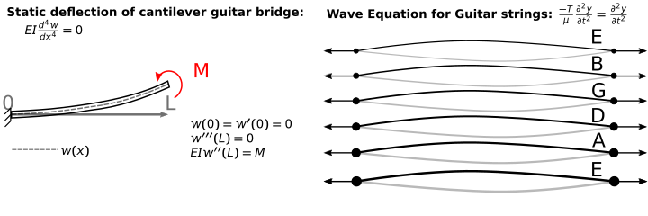

---
jupytext:
  formats: notebooks//ipynb,md:myst
  text_representation:
    extension: .md
    format_name: myst
    format_version: 0.13
    jupytext_version: 1.10.3
kernelspec:
  display_name: Python 3
  language: python
  name: python3
---

# Computational Mechanics Boundary Values - Project 05



In this final project, you will consider all six strings of a guitar and the deflection of the neck of the guitar. Here are the inputs for each of the strings, all L=0.64 m:

|string|density (g/m)|tension (kg)|
|---|---|---|
|E|0.401|7.28|
|B|0.708|7.22|
|G|1.140|7.32|
|D|2.333|8.41|
|A|4.466|9.03|
|E|6.790|7.71|

1. The neck of the guitar can be considered a cantilever beam with an applied moment, shown above. At the tip you have a moment equal to the sum of the (tensions in the strings) $\times$ (bridge height). Here you will consider it as $h=4~mm$. 

a. Use a finite difference approximation to determine the deflection of the guitar's bridge if the Young's modulus is E=10 GPa and it is a rectangular cross-section $2\times4~cm^2$ and $I=\frac{4\cdot2^3}{12}~cm^4.$

b. Demonstrate that your finite difference solution has converged. _e.g. decrease the step size $h$ and show the solution converges to a final value._

```{code-cell} ipython3
import numpy as np
from scipy import linalg
import matplotlib.pyplot as plt
plt.style.use('fivethirtyeight')
```

```{code-cell} ipython3
L = 0.64
N = 10
dx = L/(N)
I = 4*2**3/12*1/(100**4) # convert cm^4 -> m^4
E = 10e9 # N/m^2
string_vals = np.array([[0.401e-3,7.28],
                        [0.708e-3,7.22],
                        [1.14e-3,7.32],
                        [2.333e-3,8.41],
                        [4.466e-3,9.03],
                        [6.79e-3,7.71]])
M = np.sum(string_vals[:,1]*9.81)*4e-3
```

2. Here, record the first three frequencies of the 6-string guitar. 

a. Consider the G-string on the guitar, L=0.64 m, $\mu=1.14~g/m,$ and T=71.81 N [1]. 

__Guitar string equation:__ $\mu\frac{\partial^2 y}{\partial t^2}=T\frac{\partial ^2 y}{\partial x^2}$

a. Calculate the first, second, and third natural frequencies using 6, 30, 45, and 60 nodes. Plot the mode shapes and determine the number of nodes needed to converge for the first three modes.

```{code-cell} ipython3
def guitar_modes(N,L = 0.64,T = 71.81,mu = 1.14e-3):
    '''General Finite Difference Wave Equation
    in a guitar string
    of the form T/mu*d^2y/dx^2=d^2y/dt^2
    Arguments:
    ----------
    N: number of elements in guitar string finite diff
    L: length of guitar string
    T: tension in string
    mu: string density in kg/m
    Returns:
    ----------
    e: eigenvalues (frequency [rad/s]) of guitar string
    v: eigenvectors (mode shapes) of guitar string
    '''
    dx = L/(N+1)
```

b. Use the number of nodes necessary for convergence to calculate the first 3 modes of vibration for the other 5 strings on the guitar. Display the first three natural frequencies for all six strings. 

In this final project, you will consider all six strings of a guitar and the deflection of the neck of the guitar. Here are the inputs for each of the strings, all L=0.64 m:

|string|density (g/m)|tension (kg)|
|---|---|---|
|E|0.401|7.28|
|B|0.708|7.22|
|G|1.140|7.32|
|D|2.333|8.41|
|A|4.466|9.03|
|E|6.790|7.71|

```{code-cell} ipython3
string_name = ['E','B','G','D','A','E']
string_vals = np.array([[0.401e-3,7.28],
                        [0.708e-3,7.22],
                        [1.14e-3,7.32],
                        [2.333e-3,8.41],
                        [4.466e-3,9.03],
                        [6.79e-3,7.71]])
```


c. Create an audio signal that has the 18 frequencies (6 strings $\times$ 3 modes) in an array and display it using the `from IPython.display import Audio` library. 

_Hint: you don't need to solve the differential equations here. You can use the calculated frequencies to add sine-waves together:_ $\sin(f_12\pi t)+\sin(f_22\pi t)+...$

```{code-cell} ipython3
rate = 20000
t = np.linspace(0,3,rate*3)
signal = np.zeros(len(t))
```

```{code-cell} ipython3
from IPython.display import Audio
```

```{code-cell} ipython3
Audio(data = signal,rate=rate)
```
